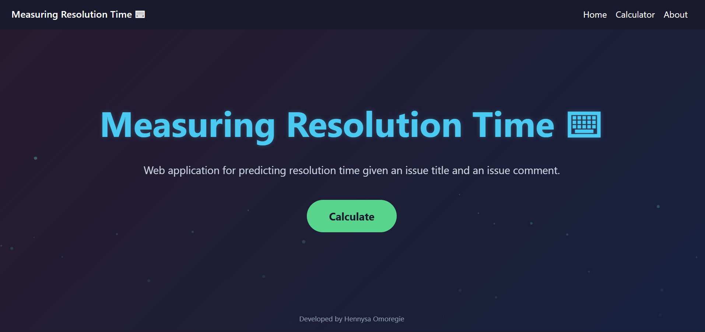

# Measuring Resolution Time in Issue Tracking Systems Using Communication Tone and Content Analysis

The replication package for the project paper *Measuring Resolution Time in Issue Tracking Systems Using Communication Tone and Content Analysis*.  
  
This repository also contains the web application operationalized from the regression analysis done measuring initial issue comment length, %tone, %relevance, and %toxicity vs. resolution time, using the first two datasets mentioned in [Dataset Sources and References](). The requirements for running the web application can be seen below.



## Web Application Requirements

Download the latest version and unzip. The modules listed below will need to be installed first. It is recommended to use a virtual environment. If using a Linux-based distribution, you can use the command `bash setup.sh` to quickly faciliate this. Otherwise:

```sudo apt install nginx
pip install django gunicorn
pip install django-widget-tweaks
pip install django-mathfilters
pip install django-jazzmin
pip install load-dotenv
pip install Pillow
pip install requests
```

The web application is located in the folder `./webworkspace/`. Thus, to run the application, you can `cd webworkspace` and run the command `python manage.py runserver`. 

## Folder Directory Navigation

The `./dataset` folder contains all Python script files needed to replicate the results used in building the the web application, if the user chooses to. Note that due to the size of the files, the initial input files used to calculate the regression equations as well as evaluate the predicted vs. actual resolution times from initial issue comments were not included in the repository, however, as mentioned previously, the user can refer to the [Dataset Sources and References]() section. 
  
Within the `dataset` folder, there is `csvFiles`, which are the final `.csv` outputs after running all the necessary script files in order. `regressionEquations` are the equations from regression analysis for each linguistic characteristic of an initial issue comment written into individual text files. `sample` contains a small sample of issues from the second listed dataset, not used in regression modeling. 

Similarly, the `./rRegression` folder contains all the R script files, as well as the exports from regression modeling and statistical analysis. 

`./seleniumTests` contain Python code for testing the form submission and navigation of the running web application. Note that the web application *needs to be running remotely* for the tests to pass. The user should also change the web address as needed if it is not http://127.0.0.1:8000/.

Finally, `./webworkspace` contains the actual Django web application. See [Web Application Requirements]() for the instructions on how to run the web application.
  
## Dataset Sources and References:
1. [JIRAIssue](https://zenodo.org/records/8237408)
2. [The Good First Issue Recommendation](https://zenodo.org/records/6837711)
3. [Toxicity](https://arxiv.org/html/2502.08238v1)
